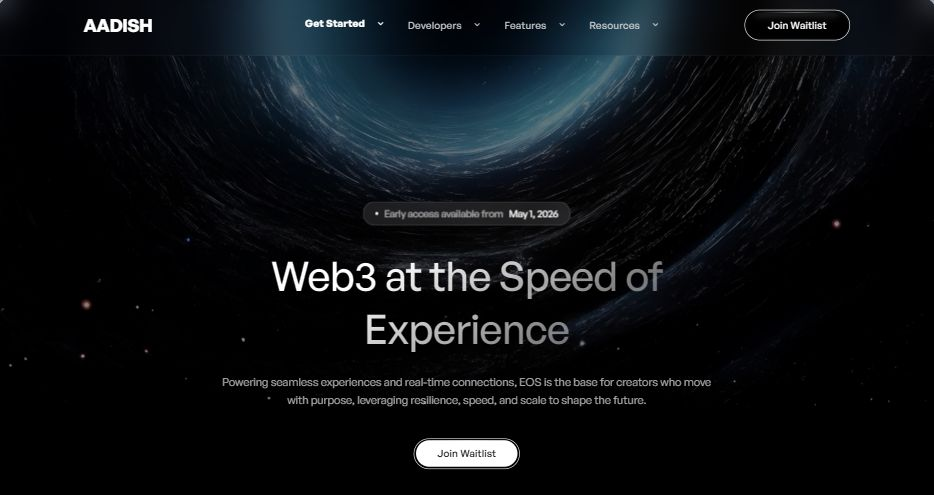

# 🌌 Animated Background Web3 Hero (Black Hole)

## **Example Live Site:** [Click Here](https://ai.studio/apps/54d258dc-7682-4487-8e1b-5ea98c2c23a3?fullscreenApplet=true)  
> **Source / Platform Inspiration:** [MotionSites AI](https://motionsites.ai/)  
> **Ideal Coding Assistants:** [v0.dev](https://v0.dev/) • [Google AI Studio](https://aistudio.google.com/) • [Cursor](https://www.cursor.com/) • [Claude Artifacts](https://claude.ai/)

---

## 📸 Visual Previews

### 🖼️ Still Image Preview


### 🎥 Live Video Demonstration
<video src="https://d8j0ntlcm91z4.cloudfront.net/user_38xzZboKViGWJOttwIXH07lWA1P/hf_20260217_030345_246c0224-10a4-422c-b324-070b7c0eceda.mp4" poster="./preview.webp" controls autoplay loop muted playsinline width="100%">
  <source src="./preview.mp4" type="video/mp4">
  <source src="https://d8j0ntlcm91z4.cloudfront.net/user_38xzZboKViGWJOttwIXH07lWA1P/hf_20260217_030345_246c0224-10a4-422c-b324-070b7c0eceda.mp4" type="video/mp4">
</video>

*Full-screen pure black Web3 landing page hero featuring a looping cosmic black hole video background with 50% dark overlay, General Sans typography, subtle top-glow layered pill buttons, and gradient clip heading.*

---

## 🛠️ Design & Technical Specifications

| Element | Specification |
|---|---|
| **Typography** | **General Sans** from [Fontshare](https://www.fontshare.com/fonts/general-sans) |
| **Background** | Pure black (`#000000`) with full-screen looping video (`autoplay`, `muted`, `loop`, `playsInline`) |
| **Overlay** | `bg-black/50` (50% black backdrop overlay for optimal text contrast) |
| **Video URL** | `https://d8j0ntlcm91z4.cloudfront.net/user_38xzZboKViGWJOttwIXH07lWA1P/hf_20260217_030345_246c0224-10a4-422c-b324-070b7c0eceda.mp4` |
| **Heading Effect** | Linear gradient (`144.5deg`, solid white 28% to transparent black 115%) with `bg-clip-text` |
| **Pill Buttons** | Layered construction: `0.6px` solid white outer border + blurred white top light streak + pill container |

---

## 💻 The Prompt (Copy & Paste)

Copy and paste the exact prompt below into Claude, v0, Cursor, ChatGPT, or Google AI Studio:

```text
Build a full-screen hero section for a Web3 landing page. Use the font "General Sans" (from Fontshare) throughout. The entire section has a pure black (#000000) background with a fullscreen looping background video (muted, autoplay, playsInline) using this URL: https://d8j0ntlcm91z4.cloudfront.net/user_38xzZboKViGWJOttwIXH07lWA1P/hf_20260217_030345_246c0224-10a4-422c-b324-070b7c0eceda.mp4. The video is covered by a 50% black overlay (bg-black/50) for readability. All content sits on top of the video.

Navbar: Horizontally spread across the top with 120px horizontal padding and 20px vertical padding. Left side: a placeholder logo wordmark (use "LOGOIPSUM" or similar) in white, 187px wide and 25px tall, followed by 4 nav links spaced 30px apart: "Get Started", "Developers", "Features", "Resources". Each nav link is white, 14px, font-medium, with a small white 14px chevron-down arrow icon to the right (14px gap between label and arrow). Nav links are hidden on mobile. Right side: a "Join Waitlist" pill button. This button has a subtle layered construction — a fully rounded pill shape with a thin 0.6px solid white outer border, and inside that, a black-background pill with the text "Join Waitlist" in white, 14px, font-medium, centered with 29px horizontal and 11px vertical padding. There's also a subtle white glow/light streak effect along the top edge of the button (a blurred white-to-transparent gradient blob positioned at the top).

Hero Content (centered below the navbar): Vertically centered in the remaining viewport space, pushed down with about 280px top padding on desktop (200px on mobile), 102px bottom padding. All content is horizontally centered and stacked vertically with 40px gaps.

Badge/pill: A small rounded pill (20px border-radius) with 10% white background and a 1px white/20% border. Inside: a tiny 4px white dot, then text reading "Early access available from" in white at 60% opacity, followed by " May 1, 2026" in solid white. Font is 13px, font-medium.

Heading: Large text reading "Web3 at the Speed of Experience", max-width 613px, 56px on desktop / 36px on mobile, font-medium, line-height 1.28. The text has a gradient fill — a linear-gradient at ~144.5 degrees going from solid white (at ~28%) to fully transparent black (at ~115%), applied as a background-clip text effect so the text itself shows the gradient.

Subtitle: Below the heading with a 24px gap. Text reads: "Powering seamless experiences and real-time connections, EOS is the base for creators who move with purpose, leveraging resilience, speed, and scale to shape the future." — 15px, font-normal, white at 70% opacity, max-width 680px, centered.

CTA Button: A "Join Waitlist" pill button similar to the navbar button but with a white background and black text instead. Same layered construction: 0.6px white outer border, white glow streak on top, and inside the white pill the text is 14px font-medium black, with 29px horizontal and 11px vertical padding.

The entire layout is responsive — nav links collapse on screens below md breakpoint, heading scales down, and padding adjusts.
```

---

## 🎨 Component Breakdown & Tailwind Snippets

### 1. General Sans Font Integration
```html
<!-- Add to <head> in HTML / Next.js layout -->
<link href="https://api.fontshare.com/v2/css?f[]=general-sans@400,500,600,700&display=swap" rel="stylesheet" />
```

### 2. Video Background with 50% Overlay
```tsx
<div className="fixed inset-0 w-full h-full overflow-hidden -z-10 bg-black">
  <video
    autoPlay
    loop
    muted
    playsInline
    className="absolute inset-0 w-full h-full object-cover"
    src="https://d8j0ntlcm91z4.cloudfront.net/user_38xzZboKViGWJOttwIXH07lWA1P/hf_20260217_030345_246c0224-10a4-422c-b324-070b7c0eceda.mp4"
  />
  <div className="absolute inset-0 bg-black/50" />
</div>
```

### 3. Layered Glow Pill Button
```tsx
<button className="relative group p-[0.6px] rounded-full overflow-hidden">
  {/* Top subtle light streak */}
  <div className="absolute top-0 left-1/2 -translate-x-1/2 w-3/4 h-[2px] bg-gradient-to-r from-transparent via-white to-transparent blur-[1px]" />
  <div className="rounded-full bg-white text-black px-[29px] py-[11px] text-[14px] font-medium transition-transform group-hover:scale-[1.02]">
    Join Waitlist
  </div>
</button>
```

---

[⬅️ Back to Main Repository](../README.md)
