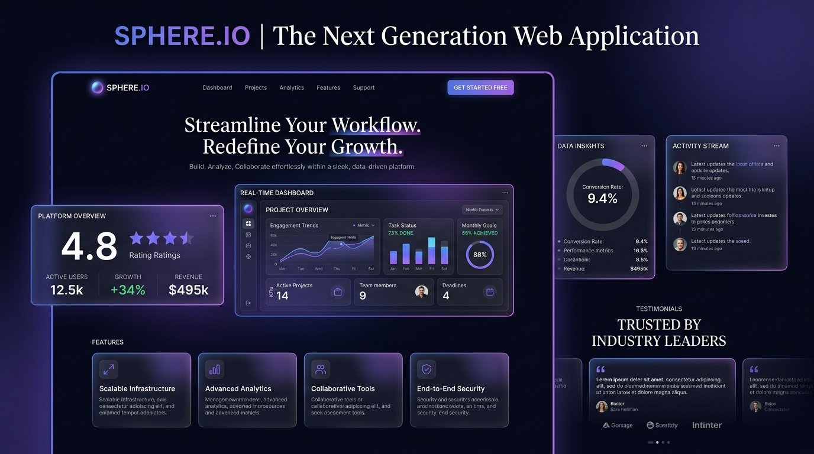
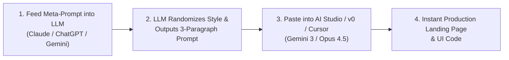

# ⚡ General Good Frontend Prompt (Meta Landing Page Generator)

> **Tested Models:** Gemini 3 Pro / Flash, Claude Opus 4.5, Claude 3.7 Sonnet, ChatGPT-4.5  
> **Ideal Generation Engines:** [Google AI Studio](https://aistudio.google.com/) (Gemini 3) • [v0.dev](https://v0.dev/) (Opus / Sonnet) • [Cursor](https://www.cursor.com/) • [Claude Artifacts](https://claude.ai/)

---

## 📸 Preview



*Example generated single-page web app showcasing dark mode glassmorphism, glowing gradient planes, ultra-clean Swiss grid typography, interactive metric widgets, and responsive layout hierarchy.*

---

## 💡 About This Prompt

With the release of next-generation frontend reasoning models like **Gemini 3** and **Claude Opus 4.5**, this prompt was engineered to rapidly benchmark, explore, and generate high-fidelity, production-grade landing pages across dozens of distinct design aesthetics.

Instead of writing manual specifications for every test, this **Meta-Prompt** acts as an AI Design Director: it randomly selects from a comprehensive library of 25+ curated design movements (or invents its own) and produces a tightly structured, **three-paragraph atmospheric concept prompt** focused on emotion, sensory feel, and narrative flow.

---

## 🔄 The 3-Step Generation Loop



1. **Generate the Creative Brief:** Copy the Meta-Prompt below into your favorite conversational AI (Claude, ChatGPT, Gemini).
2. **Transfer to Code Generator:** Copy the resulting 3-paragraph prompt and paste it into **Google AI Studio** (free Gemini 3) or **v0.dev** (free Opus/Sonnet) or **Cursor**.
3. **Repeat & Collect:** Run it multiple times to build a personal swipe file of dozens of diverse, high-aesthetic UI concepts for future client work and SaaS projects.

---

## 🎯 The Meta-Prompt (Copy & Paste)

Copy the entire block below and paste it into ChatGPT, Claude, or Gemini:

```text
Generate a ONE-PAGE LANDING PAGE creation prompt using a RANDOMLY SELECTED design style from the following list, or choose your own style if you identify something more suitable that's not listed. IMPORTANT: Use a random selection method - any method that ensures variety. DO NOT default to Neobrutalist or any particular favorite. Actually randomize your selection.

Available Design Styles (not limited to these - feel free to identify and use other professional styles):

- Neobrutalist (raw, bold, confrontational with structured impact)
- Swiss/International (grid-based, systematic, ultra-clean typography)
- Editorial (magazine-inspired, sophisticated typography, article-focused)
- Glassmorphism (translucent layers, blurred backgrounds, depth)
- Retro-futuristic (80s vision of the future, refined nostalgia)
- Bauhaus (geometric simplicity, primary shapes, form follows function)
- Art Deco (elegant patterns, luxury, vintage sophistication)
- Minimal (extreme reduction, maximum whitespace, essential only)
- Flat (no depth, solid colors, simple icons, clean)
- Material (Google-inspired, cards, subtle shadows, motion)
- Neumorphic (soft shadows, extruded elements, tactile)
- Monochromatic (single color variations, tonal depth)
- Scandinavian (hygge, natural materials, warm minimalism)
- Japandi (Japanese-Scandinavian fusion, zen meets hygge)
- Dark Mode First (designed for dark interfaces, high contrast elegance)
- Modernist (clean lines, functional beauty, timeless)
- Organic/Fluid (flowing shapes, natural curves, sophisticated blob forms)
- Corporate Professional (trust-building, established, refined)
- Tech Forward (innovative, clean, future-focused)
- Luxury Minimal (premium restraint, high-end simplicity)
- Neo-Geo (refined geometric patterns, mathematical beauty)
- Kinetic (motion-driven, dynamic but controlled)
- Gradient Modern (sophisticated color transitions, depth through gradients)
- Typography First (type as the hero, letterforms as design)
- Metropolitan (urban sophistication, cultural depth)

Instructions:

After selecting a design style (either from the list or your own professional choice), create a ONE-PAGE LANDING PAGE prompt that is EXACTLY THREE PARAGRAPHS. Focus intensely on conveying the FEELING and ATMOSPHERE of the chosen style:

Paragraph 1: State the chosen style(s) and ask the AI to conceive an innovative business/service concept for a SINGLE-PAGE landing page. Describe the core emotional qualities and feeling this style evokes - what mood should visitors experience as they arrive? How should the visual hierarchy and flow make them feel as they scroll through this single cohesive page? Include a note to incorporate colorful elements as appropriate to enhance the design's emotional impact.

Paragraph 2: Explain the design philosophy through the lens of emotion and user experience. How should typography feel - authoritative, welcoming, cutting-edge? What sensation should interactions and animations create - smooth and liquid, snappy and precise, gentle and organic? Describe how the single-page journey should emotionally progress from first impression through final call-to-action, creating a complete narrative arc in one scrolling experience.

Paragraph 3: Provide abstract reference points that capture this aesthetic's essence - think about the feeling of certain types of spaces, cultural movements, artistic periods, architectural styles, or design philosophies that embody this aesthetic. Reference the emotional qualities of premium experiences, sophisticated environments, or refined craftsmanship that should inspire the design. Explain how these abstract references should influence the emotional quality and visual sophistication of the final single-page design, without naming specific brands or platforms.

The generated prompt must emphasize this is ONE COHESIVE LANDING PAGE with a single scrolling experience. Focus on feeling, atmosphere, and abstract quality references rather than technical details or specific examples. Keep all references conceptual and high-level to allow for maximum creative interpretation.
```

---

## 🎨 25+ Design Style Reference Catalogue

| Category | Design Style | Visual Core | Atmosphere & Emotional Signature |
|---|---|---|---|
| 📐 **Structured & Systematic** | **Swiss / International** | Mathematical grid, clean sans-serif type | Precision, clarity, objective intelligence, structured calm |
| | **Bauhaus** | Primary geometries, form follows function | Industrial clarity, modernist rigor, functional artistry |
| | **Modernist** | Balanced whitespace, clean linear dividers | Timeless elegance, architectural simplicity |
| ✨ **Translucent & Dimensional** | **Glassmorphism** | Frosted glass backdrop-blur, subtle borders | Multi-layered depth, sleek futurism, ethereal luminosity |
| | **Neumorphism** | Soft dual shadows, extruded tactile surfaces | Tactile softness, gentle physical presence |
| ⚡ **Bold & Dynamic** | **Neobrutalism** | Hard black borders, saturated pop colors | Raw energy, unapologetic confidence, high-impact youth |
| | **Kinetic** | Dynamic scroll physics, fluid typography | Constant momentum, electric vitality, engaging velocity |
| | **Gradient Modern** | Rich multi-stop color transitions, glows | Saturated warmth, premium tech ambiance, modern luxury |
| 🌿 **Serene & Natural** | **Japandi** | Earthy palettes, Wabi-Sabi textures, wood tones | Zen stillness, organic warmth, intentional tranquility |
| | **Scandinavian** | Hygge comfort, abundant light, soft pastels | Welcoming warmth, cozy functionality, airy lightness |
| | **Organic / Fluid** | Curvilinear SVG blobs, asymmetrical masks | Living nature, flowing softness, human harmony |
| 🏛️ **Luxury & Editorial** | **Editorial** | Magazine serif mastheads, large hero quotes | Cultural authority, literary depth, high-fashion polish |
| | **Art Deco** | Symmetrical gold filigree, geometric glamour | 1920s opulence, Great Gatsby elegance, bespoke craft |
| | **Luxury Minimal** | Generous whitespace, refined micro-accents | Quiet luxury, exclusive restraint, effortless prestige |
| 🌑 **High-Tech & Future** | **Dark Mode First** | Deep obsidian/slate backdrops, neon accents | Deep focus, nighttime sophistication, luminous immersion |
| | **Retro-Futuristic** | 80s synth grids, CRT glows, chrome details | Refined nostalgia, retro sci-fi optimism, neon dreams |
| | **Tech Forward** | Interactive telemetry, metric pill badges | High-speed innovation, developer mastery, cutting edge |

---

## 📝 Example Output: What the Meta-Prompt Produces

Here is an example of what an LLM outputs when running the Meta-Prompt:

### Selected Style: *Dark Mode Glassmorphism + Tech Forward*

```text
Create a modern, high-conversion single-page landing page for "NexusAI", an autonomous edge-compute intelligence network. The interface must be built with a Dark Mode First glassmorphic aesthetic that immediately immerses visitors in a sense of deep technological mastery, ethereal depth, and high-velocity clarity. The visual hierarchy should guide the eye effortlessly through translucent frosted-glass containers, glowing violet-to-cyan ambient lighting, and vivid dynamic telemetry widgets that make complex computational power feel tangible and responsive.

The design philosophy balances razor-sharp precision with liquid fluidity. Typography must pair ultra-clean geometric sans-serif headers with monospace metric counters to convey cutting-edge authority. UI interactions should feel snappy and frictionless, featuring smooth backdrop-blur transitions, interactive hover cards that illuminate on pointer approach, and subtle glowing borders that shift with user scroll. The narrative arc moves seamlessly from an attention-grabbing hero telemetry visual down through interactive feature capsules, a live comparative benchmark calculator, and a high-impact luminous call-to-action.

Draw inspiration from the quiet intensity of an aerospace mission control room at midnight, high-end optical glass lenses catching prismatic light, and precision-machined obsidian instruments. The landing page must feel like a singular, continuous digital artifact that breathes with real-time energy, exuding uncompromised engineering polish and visual sophistication.
```

---

## 🚀 Recommended Tooling

| Tool | Model / Engine | Best For | Link |
|---|---|---|---|
| **Google AI Studio** | Gemini 3 Pro / Flash | Fast prototyping, full-page HTML/CSS/JS generation, complex components | [aistudio.google.com](https://aistudio.google.com/) |
| **v0 by Vercel** | Claude 3.7 Sonnet / Opus | Next.js, React, Tailwind CSS, Lucide icons, full UI component trees | [v0.dev](https://v0.dev/) |
| **Cursor IDE** | Opus 4.5 / Sonnet 3.7 | Directly embedding generated landing pages into your codebase | [cursor.com](https://www.cursor.com/) |
| **Bolt.new** | Claude 3.7 Sonnet | In-browser fullstack sandbox deployment | [bolt.new](https://bolt.new/) |

---

[⬅️ Back to Prompt Directory](../README.md)
