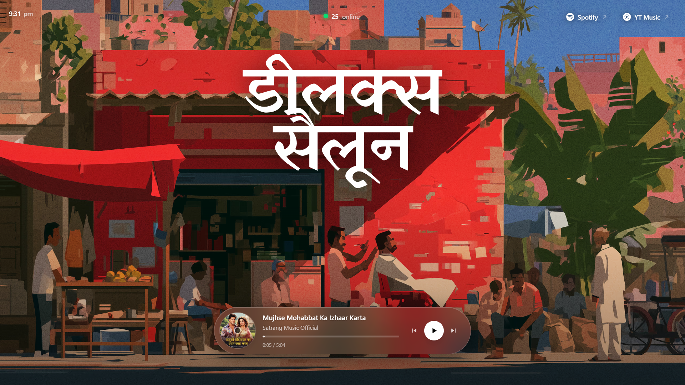
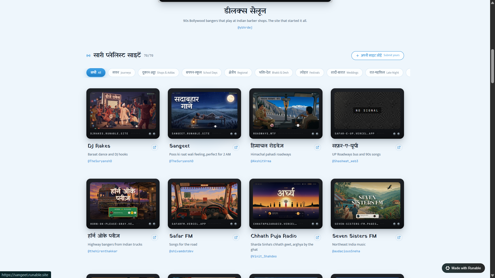

# 📻 Build a Viral Radio Site in One Prompt

> **Example Live Site:** [https://playlist.runable.site/](https://playlist.runable.site/)  
> **Original Source Guide:** [Notion Guide](https://midi-garment-d51.notion.site/Build-a-viral-radio-site-in-one-prompt-3ba13d90aa8f80bd8b4fce659d777333)

---

## 📸 Preview



*Example live player interface with aesthetic painted 2D background artwork, floating glassmorphism player, and live clock/listener counter.*



*The curated playlist hub showcase from [playlist.runable.site](https://playlist.runable.site/).*

---

## ⚠️ Read This First — Terms of Use

**This guide is provided free, for educational purposes, with no warranty of any kind.**

**By using it you accept the following, in full:**

- **You are solely responsible for every piece of content you put on your site** — every song, every image, every asset. Not me.
- **Do not use copyrighted music, artwork or video you do not own or have permission to use.** Record labels actively monitor for their catalogue and will send takedown notices.
- **I accept no liability whatsoever** for any copyright claim, DMCA notice, legal action, takedown, account suspension, hosting bill or loss of any kind arising from your use of this guide.
- **This is not legal advice.** If you receive a notice or a legal letter, consult a qualified lawyer in your jurisdiction.
- **Check YouTube's Terms of Service and Developer Policies yourself** before you publish, and comply with them.
- **Do not monetise a site built this way.** No ads, no subscriptions, no paywalls. Commercial use dramatically increases your exposure.

**If you are not comfortable taking full responsibility for what you publish, do not use this guide.**

---

## 🛠️ Before You Start

**You need three things:**

| # | What | Where to get it |
|---|------|-----------------|
| 1 | **Artwork — landscape** (~1672×941) | Generate it, or use ready-made scenes from [📁 Visual Assets Gallery](./assets/). |
| 2 | **Artwork — portrait** (~941×1672) | Generate the **same scene** recomposed vertically. Not a crop — a crop kills the composition on phones. |
| 3 | **A logotype PNG** with transparent background | Your site’s name, drawn. Not a font. |

- **Tools:** Node 20+, and `yt-dlp` (`brew install yt-dlp` or OS equivalent) — the script uses it to turn song names into YouTube IDs.
- **A tip that matters:** Pick artwork with a calm, dark band along the bottom (a road, a floor, a shadow). That’s where the player sits. If the bottom of your image is busy, the player will bury the best part of it.

---

## 🎨 1. The Artwork Prompt (Paste into ChatGPT / Midjourney / Any Image Model)

This makes the wide background. The **ART STYLE is locked** — that is what makes it look like a real painted animation background instead of AI slop, and you only swap the theme. Fill in the brackets first, then paste the whole block. Change nothing else.

### Fill these in:

```text
[SETTING]           = the place, e.g. an ordinary Indian urban neighbourhood
[ERA]               = the time period, e.g. the late 1980s / 1990s
[FOCAL SHOP]        = the little shop at the heart of it, e.g. a neighbourhood music / cassette shop
[NOSTALGIC OBJECTS] = the objects that carry the memory, e.g. cassettes, transistor radios, old two-speaker players
[STREET LIFE]       = what the figures are doing, e.g. buying tapes, listening, playing gully cricket, leaning on a scooter
[PALETTE]           = the dominant colours, e.g. terracotta, ochre, faded coral, dusty teal
```

### The Prompt:

```text
CREATE ONE SINGLE WIDE 16:9 PAINTED 2D BACKGROUND ARTWORK.

The most important instruction is this:

DO NOT THINK OF THIS AS A SCENE TO RENDER.
DO NOT THINK OF THIS AS PEOPLE AND OBJECTS TO DRAW REALISTICALLY.
DO NOT THINK OF THIS AS A PHOTOGRAPH TO BE STYLIZED.

THINK OF IT AS A HAND-PAINTED 2D BACKGROUND ARTWORK CONSTRUCTED ENTIRELY FROM LARGE OPAQUE PAINTED COLOR SHAPES, SILHOUETTES, GRAPHIC VALUE PLANES, simplified environmental forms, controlled perspective, deliberate negative space, and physical-looking gouache/tempera pigment variation.

The artwork should feel like an authentic painted background from a sophisticated 2D animated film / editorial illustration, an image where the artist communicates an entire world through the minimum number of carefully chosen painted shapes.

The subject is [SETTING] from [ERA], carrying the visual memory of [NOSTALGIC OBJECTS], everyday life, and [STREET LIFE].

BUT THE PERIOD SUBJECT MUST NEVER OVERRIDE THE ART STYLE.

The artwork must look as though an artist first designed the composition using large flat painted shapes and then gradually added a limited number of hand-painted marks, rather than as though a realistic scene was rendered and then given a vintage treatment.

--------------------------------------------------
CORE VISUAL LANGUAGE — ABSOLUTELY CRITICAL
--------------------------------------------------

Everything must be represented through COLOR SHAPES before it is represented through detail.

Imagine that the entire image could first be constructed from pieces of opaque colored paper: large wall shape + large shadow shape + large shop shape + large sky shape + large tree shape + large street shape + large human silhouettes + large object silhouettes + small graphic marks + paint imperfections.

Every major object must remain readable even if all texture is removed. The artwork should therefore have extremely strong shape hierarchy.

Do NOT create objects through realistic rendering, gradients, reflections, physically accurate materials or microscopic surface detail. Instead, construct them using approximately 2 to 6 major painted planes. Apply this same shape-reduction to every one of your [NOSTALGIC OBJECTS]. For example:

A radio = dark rectangular body + lighter front plane + a few circular/rectangular graphic marks + one or two highlights.
A small object (like a cassette) = small rectangular silhouette + one or two contrasting blocks + tiny graphic marks.
A bicycle = large dark frame silhouette + two circular wheels + a handful of structural lines.
A scooter = one large painted body silhouette + dark seat + dark wheels + handlebar silhouette + a few graphic highlights.
A building = large geometric color field + large shadow plane + windows + roofline + a few small architectural marks.
A tree = large irregular dark-green mass + secondary green masses + small lighter painted leaf shapes.

The viewer must recognize the object through SHAPE LANGUAGE, not realistic rendering.

--------------------------------------------------
PEOPLE — THIS IS CRITICAL
--------------------------------------------------

DO NOT DRAW REALISTIC PEOPLE. DO NOT DRAW PORTRAITS. DO NOT DRAW DETAILED FACES. DO NOT DRAW EXPRESSIVE FACIAL FEATURES. DO NOT DRAW REALISTIC EYES. DO NOT DRAW DETAILED NOSES. DO NOT DRAW LIPS. DO NOT DRAW SKIN TEXTURE. DO NOT DRAW IDENTIFIABLE HUMAN FEATURES. DO NOT DRAW PEOPLE LOOKING AT THE CAMERA. DO NOT MAKE PEOPLE LOOK LIKE AI-GENERATED MODELS. DO NOT INTERPRET "NO FACES" AS "BLUR THE FACES."

There should simply be NO facial information to begin with.

The human figures must be constructed exactly like painted background characters: HEAD SHAPE + HAIR SHAPE + TORSO SHAPE + ARM SHAPES + LEG SHAPES + CLOTHING SHAPES + GESTURE.

The head is only a graphic shape. A face is NOT rendered inside the head. No facial reconstruction. No portrait information. No identifiable expression. The viewer should infer a person from their silhouette and posture, not from their face.

Think: dark head mass + cream shirt mass + dark trouser mass + angular arm + gesture. NOT: realistic human + hidden face.

The people are environmental graphic elements. They exist to communicate [STREET LIFE] through GESTURE and SILHOUETTE, using the minimum number of shapes required to communicate the action. The pose and relationship between figures must communicate the story. Faces should be blank painted masses, turned away, hidden by shadow, seen only as tiny distant shapes, or simply absent as facial information.

--------------------------------------------------
NO CARTOON OUTLINES
--------------------------------------------------

Do NOT outline people or objects with black ink. There should be no thick cartoon line around the characters. Edges must be created by the meeting of contrasting painted shapes (dark green wall against light cream shirt creates the edge of the person; dark bicycle against sunlit pavement creates the edge). The sophistication comes from VALUE CONTRAST and COLOR CONTRAST, not black outlines. Use painted boundaries, not graphic cartoon outlines.


--------------------------------------------------
COMPOSITION
--------------------------------------------------

Use a wide 16:9 horizontal composition at approximately human eye level. Create a dense ordinary [SETTING] rather than a spectacular cityscape.

Place a small [FOCAL SHOP] toward the left-middle portion of the frame. The shop should primarily be represented as: dark rectangular opening + rough awning silhouette + counter shape + shelves + small [NOSTALGIC OBJECTS] shapes + anonymous human silhouettes. The shop interior should be extremely dark compared with the sunlit exterior. The darkness should be a major compositional shape. Do not illuminate every object inside; only selected objects emerge through small painted value accents. The shop should feel like a dark painted cavity inside a much warmer wall.

Outside the shop, create an ordinary street with the everyday elements of [SETTING] and [ERA]: bicycles, crates, boxes, a scooter, anonymous pedestrians, an anonymous shopkeeper and customers, children playing, old buildings, stairs, trees, clotheslines, electrical poles, wires, rooftops, water tanks, satellite dishes, and your [NOSTALGIC OBJECTS]. Every one of these must remain a graphic painted representation rather than a realistic object render.

--------------------------------------------------
ARCHITECTURE
--------------------------------------------------

Use dense, low-rise architecture appropriate to [SETTING] and [ERA], primarily as large painted geometric planes drawn from [PALETTE] (terracotta plaster, faded coral, ochre, dusty cream, muted red, brown, weathered teal, blue-green). Buildings should have imperfect hand-painted geometry, not perfectly straight or CAD-like; slight irregularity is desirable. Windows, doors, balconies, stairs, pipes, electrical boxes, rooftop structures, water tanks, satellite dishes, railings, clotheslines and roof edges are secondary marks placed on top of large architectural masses. The architecture should feel compressed and illustrative rather than architecturally photographed.

--------------------------------------------------
THE CENTRAL WEATHERED WALL
--------------------------------------------------

Make the main wall an enormous graphic color field, NOT a photorealistic dirty wall. Create deliberate painted layers: base plaster + large faded paint field + large contrasting repaint patches + poster rectangles + torn paper shapes + scratches + paint chips + small cracks + dark grime marks + additional paint fragments. Use large blocks drawn from [PALETTE]. The imperfections must have SHAPE LANGUAGE; do not apply random grunge noise or generic procedural dirt. Every visible imperfection should feel intentionally placed. Some edges clean, some broken, some dry-brushed, some showing underlying pigment. Balance roughly 80% controlled painted edges + 20% irregular hand-painted edges.


--------------------------------------------------
YOUR NOSTALGIC OBJECTS
--------------------------------------------------

Represent your [NOSTALGIC OBJECTS] as simple graphic shapes, not photorealistic products. No polished chrome, no glossy reflections, no PBR materials. Matte painted surfaces with simple circular and rectangular marks. Stack and scatter them irregularly (on shelves, on a counter, in wooden crates, some leaning or hanging). The object is a graphic shape; the world is understood through the RELATIONSHIP between shapes.

--------------------------------------------------
LIGHTING
--------------------------------------------------

Use strong LOW-ANGLE LATE-AFTERNOON SUNLIGHT as a deliberate graphic design element. Warm sunlight strikes the exposed walls and pavement (amber, ochre, burnt orange, terracotta, warm cream, sienna). Shadows shift strongly toward deep olive, green-black, blue-green, cool brown, charcoal, dark maroon. The shadows must HAVE COLOR; never use flat neutral black everywhere. A warm red wall in shadow becomes dark burgundy/green-brown; a cream wall in shadow becomes blue-green/charcoal; a green tree in shadow becomes almost black olive. This warm/cool opposition is a primary structural device.

--------------------------------------------------
SHADOWS
--------------------------------------------------

DO NOT create realistic soft photographic shadows. Create LARGE, GRAPHIC, PAINTED SHADOW PLANES with strong boundaries: SUNLIT COLOR PLANE then HARD SHADOW BOUNDARY then COOL DARK COLOR PLANE. Shadow shapes may be slightly exaggerated for composition. Use architectural shadows from awning, roof, balconies, walls, poles, trees, people, bicycles, scooter. Tree shadows appear as broken organic painted shapes across walls and ground. The shop entrance has an especially deep shadow mass. Use painted contact shadows beneath feet, bicycle, scooter, crates, boxes, counter, steps and wall junctions, not realistic ambient occlusion.

--------------------------------------------------
VALUE STRUCTURE
--------------------------------------------------

Extremely strong large-scale value grouping. Deepest values: shop interior, under awnings, architectural recesses, undersides, contact shadows, certain foliage. Brightest values: sunlit walls, sunlit pavement, selected clothing planes, sunlit architectural edges. Do not make everything medium brightness. The artwork depends on large dark masses against large warm illuminated masses. Graphic, intentional contrast. But DO NOT create HDR, photographic dynamic range, glowing highlights, lens flare or bloom. Paint the contrast as shapes.

--------------------------------------------------
TREE AND FOLIAGE LANGUAGE
--------------------------------------------------

Never render individual realistic leaves. Use large dark-green mass + medium green mass + olive mass + small warm highlights. The negative spaces between foliage masses matter. Leaves are designed shapes; branches occasionally appear as dark graphic lines. The tree reads instantly from its silhouette.

--------------------------------------------------
SKY
--------------------------------------------------

A large muted dusty-blue pigment field. No dramatic sunset, no photographic clouds, no atmospheric gradients. Only subtle painterly variation. The sky is a cool counterpoint to the warm architecture.

--------------------------------------------------
STREET
--------------------------------------------------

A broad painted warm earth-colored plane (dusty brown, ochre, terracotta, warm grey, muted orange). A few large irregular cracks, patches and graphic marks. No photorealistic asphalt texture, no repetitive procedural pavement noise. Broad painted planes plus a handful of deliberate marks.

--------------------------------------------------
DEPTH
--------------------------------------------------

Depth must be GRAPHICALLY COMPRESSED. No photographic depth of field, no background blur, no strong lens perspective, no realistic atmospheric perspective. Use overlap + scale + value grouping + slightly cooler distant colors + simplified distant shapes + reduced contrast. The background stays readable, like painted stage scenery rather than a photograph.

--------------------------------------------------
PAINT MATERIAL
--------------------------------------------------

The surface should resemble opaque gouache/tempera on slightly rough paper: uneven pigment density, subtle dry-brush, broken paint, slightly rough paper tooth, small pigment irregularities, occasional visible brush direction, softly imperfect edges, small areas of underlying pigment. But maintain strong opaque color masses. Do NOT turn it into an impressionist painting; do NOT let brush strokes dominate every object. Texture supports the shapes; the artwork stays visually clear.

--------------------------------------------------
EDGE LANGUAGE
--------------------------------------------------

Major forms mostly have controlled edges with occasional organic irregularity. Avoid perfect vector edges, thick outlines, blurred photographic edges, and overly messy painterly edges. Use a sophisticated balance of hard painted edges + slightly broken pigment edges + occasional dry-brush edges.

--------------------------------------------------
ERA
--------------------------------------------------

The [ERA] identity should come from OBJECTS AND BEHAVIOR, not a filter. Use the everyday objects, clothing, vehicles, infrastructure and activities of [SETTING] in [ERA] (for a 1990s Indian street: cassettes, analog radios, bicycles, rounded scooters, old clothing, cricket, old posters, dense concrete homes, water tanks, clotheslines, analog electrical infrastructure, small shops). No smartphones, no modern cars, no contemporary motorcycles, no modern advertising, no LED signage, no modern architecture, no modern clothing, no modern technology. Do not apply a generic retro filter. The nostalgia must exist inside the world itself.

--------------------------------------------------
EMOTIONAL TARGET
--------------------------------------------------

The image should feel like a remembered place rather than a documented place: ordinary, warm, dusty, quietly joyful, lived-in, nostalgic, slightly melancholic, intimate, human, handmade. The goal is NOT "look at this cool street." The goal is "this feels like a memory of a place that used to exist."

--------------------------------------------------
ABSOLUTE NEGATIVE STYLE INSTRUCTIONS
--------------------------------------------------

NO photography. NO photorealism. NO 3D. NO CGI. NO Blender look. NO Unreal Engine look. NO PBR materials. NO realistic human skin. NO realistic faces. NO identifiable faces. NO portraits. NO celebrity likenesses. NO detailed eyes/noses/mouths. NO facial expressions. NO model-like people. NO AI beauty. NO black cartoon outlines. NO vector art. NO flat modern corporate illustration. NO photographic depth of field. NO bokeh. NO lens flare. NO bloom. NO HDR. NO glossy digital lighting. NO realistic reflections. NO procedural grunge. NO random digital noise. NO generic vintage filter. NO sepia filter. NO excessive film grain. NO readable text. NO logos. NO modern signage. NO realistic poster portraits. NO over-rendered objects. NO microdetail everywhere. NO perfect architectural geometry. NO hyperrealism.

--------------------------------------------------
FINAL ARTISTIC PRINCIPLE
--------------------------------------------------

The entire image must obey this hierarchy: SHAPE FIRST. VALUE SECOND. COLOR THIRD. GESTURE FOURTH. OBJECT RECOGNITION FIFTH. TEXTURE LAST.

Every object first exists as a painted silhouette. Every person first exists as a gesture. Every building first exists as a color plane. Every shadow first exists as a graphic shape. Every texture mark feels intentionally painted. The viewer recognizes the environment because of the RELATIONSHIP BETWEEN SHAPES, not because the image contains realistic objects.

The artwork must look as though a highly skilled illustrator painted a complete [SETTING] from memory using a limited palette of opaque gouache/tempera pigments, deliberately simplifying everything that did not need to be represented.

The final image should be: a sophisticated hand-painted 2D animation background + editorial illustration + gouache poster sensibility + large opaque color masses + anonymous gesture-based human silhouettes + warm late-afternoon sunlight + cool graphic shadows + flattened perspective + distressed but deliberately painted surfaces + [ERA] everyday-life objects + deep environmental storytelling + controlled imperfection.

MOST IMPORTANTLY:
DO NOT DRAW THE IDEA OF A REALISTIC PERSON. PAINT THE SHAPE THAT MAKES THE VIEWER UNDERSTAND THERE IS A PERSON.
DO NOT DRAW THE IDEA OF A REALISTIC OBJECT. PAINT THE FEW SHAPES THAT MAKE THE VIEWER UNDERSTAND WHAT IT IS.
DO NOT RENDER A REALISTIC [SETTING]. PAINT THE VISUAL MEMORY OF ONE.

The final result must look like ART first and an illustration of a place second.
```

> **For the portrait asset:** Paste the same prompt but change the first line to `CREATE ONE SINGLE TALL 9:16 PAINTED 2D BACKGROUND ARTWORK`, and recompose the same `[SETTING]` vertically. It must be a fresh vertical composition, never a crop of the wide one.  
> **For the logo:** Ask for a hand-drawn wordmark of your site’s name on a transparent background, in the same gouache/painted spirit, not a font.

---

## 💻 2. The Code Generation Prompt (Paste into Claude / Cursor / ChatGPT)

Copy everything in the block below:

```text
Build me a single-page nostalgia music site in Next.js.

## Stack
- Next.js, App Router, TypeScript, `app/` at the project root (no `src/`)
- Tailwind CSS v4 using `@theme` tokens in `app/globals.css` (no tailwind.config)
- Dependencies: next, react, react-dom, @vercel/analytics, @vercel/speed-insights
- No CSS-in-JS, no component library, no state manager

## Assets I will provide
- `public/bg/scene-wide.png`  (landscape)
- `public/bg/scene-tall.png`  (portrait — separately composed, not a crop)

## Page layout — app/page.tsx (server component)
`<main>` is `relative flex min-h-dvh flex-1 flex-col items-center justify-between
overflow-hidden`, containing:
1. Fixed background div, `-z-20`, class `hero-bg`, `bg-cover bg-center`. In CSS, set the
   background to `scene-wide.png`, and swap to `scene-tall.png` inside
   `@media (orientation: portrait)`. Overlay a `bg-gradient-to-b from-black/35 via-transparent to-black/80`.
2. Fixed grain overlay, `-z-10`: an inline SVG `feTurbulence` data-URI, `mix-blend-mode: overlay`, `opacity: 0.3`.
3. Fixed top row: clock top-left, listener count top-centre, social links top-right.
4. The player, bottom-anchored, `max-w-xl`.
All four fixed corners must use `max(1rem, env(safe-area-inset-*))` and the viewport
export must set `viewportFit: "cover"`.

## The player — this is the centrepiece
A floating glass pill on desktop, a stacked card on mobile. Two separate blocks
(`hidden sm:flex` / `sm:hidden`), not one reflowing layout.

Glass recipe (a flat white/10 fill reads as a grey slab, not glass):
  border border-white/10
  bg-gradient-to-b from-white/[0.15] to-white/[0.055]
  backdrop-blur-3xl backdrop-saturate-[1.7]
  shadow-[0_16px_48px_-12px_rgba(0,0,0,0.8),inset_0_1px_0_rgba(255,255,255,0.2)]

DESKTOP — one horizontal pill, `rounded-full p-3 pr-5`, left to right:
- A spinning vinyl: the cover art in a circle, 80px, `animation: spin 8s linear
  infinite`, with `animationPlayState` set to `running`/`paused` from playback
  state. Absolutely centre a 12px `bg-black/70 ring-2 ring-white/40` circle on top
  as the spindle hole.
- Title (15px semibold) and artist (12.5px white/70), both `truncate`.
- A seek bar under them: 24px invisible hit area, 3px visible rail `bg-white/15`,
  fill in the accent colour with a soft glow, knob visible on hover only.
- Elapsed / duration in 10.5px tabular-nums.
- Transport on the right: prev, play/pause, next.

MOBILE — a `rounded-[26px]` card:
  row 1: 64px vinyl + title/artist
  row 2: full-width seek bar
  row 3: elapsed/duration on the left, transport centred, 44px minimum targets
Play button is a 52px circle, `bg-gradient-to-b` in the accent colour with
`ring-1 ring-white/25` and a coloured drop shadow.

## How the music plays
There are no audio files. Load the YouTube IFrame Player API and drive it.

- IMPORTANT — only include songs I have the right to use, or that stream from
  the rights holder's own YouTube upload with embedding enabled. Do not
  suggest, search for or add copyrighted tracks on my behalf. If I ask you to
  add something you believe is copyrighted, warn me before you add it.
  
- Each track is `{ id, title, artist, film, year, duration, videoId }`.
  Adding a song must be a one-line change.
- Group tracks into 2–3 playlists. Same engine, different arrays; switching
  playlist restarts at track 1.
- **Render the player visibly** — put the iframe in the artwork slot rather than a
  static thumbnail. Do NOT hide it in a 1px/opacity-0 container: that breaks
  YouTube's Developer Policies (no background players, no separating audio from
  video) and it traps listeners on unskippable ads, because the Skip button is
  inside the player they cannot see.
- `onStateChange`: PLAYING/PAUSED drive the UI, ENDED advances the track.
- `onError`: videos get deleted or have embedding switched off AFTER you ship.
  Skip to the next track automatically and fire an analytics event with the code
  and videoId.

## Clock
`Intl.DateTimeFormat("en-IN", { timeZone: "Asia/Kolkata", hour: "numeric",
minute: "2-digit", hour12: true })`, ticking every second, with the colon blinking
via `@keyframes blink { 50% { opacity: 0 } }`.

## Gotchas — please get these right the first time
- Define sub-components at MODULE scope, never inside the parent component.
  Declared inside, they get a new function identity each render, React remounts
  the subtree, and the vinyl's CSS animation restarts from 0deg on every progress
  tick (~2.5×/second).
- Do NOT download or re-host YouTube thumbnails onto my domain. The visible
  player displays the artwork itself, and copying label images is a separate
  infringement from the music. If I ever ask for cached covers anyway, keep
  the source 16:9 and display it in `aspect-video` — square-cropping a 16:9
  thumbnail throws away the sides and then crops it again.
- Cover art: keep the source 16:9 and display it in `aspect-video`. Square-cropping
  a 16:9 thumbnail throws away the sides and then crops it again.
- `next/image` inside a flex column gets stretched by `align-items: stretch` — add
  `self-start` or an explicit width.
- Use `onPointerDown` for seeking, not `onClick`, and add `touch-none` so dragging
  doesn't scroll the page.
- Never gate the play button behind a `canplay` event — iOS Safari won't fire it
  before a user gesture and the button stays dead forever.
```
