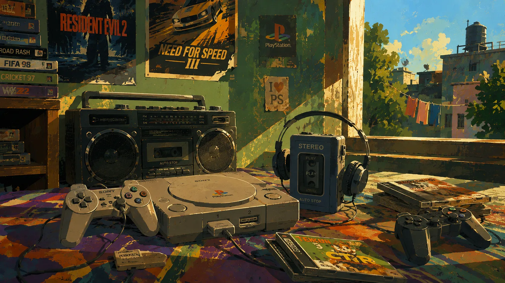
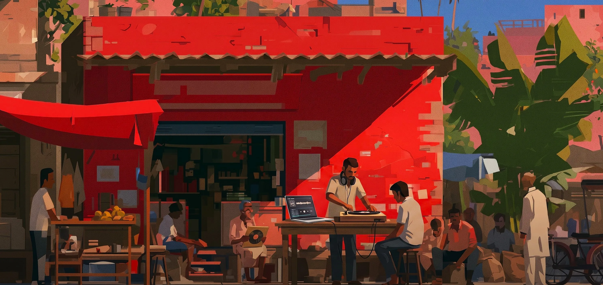
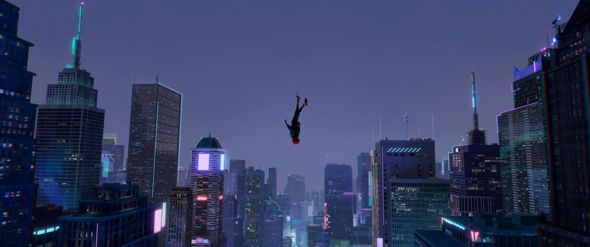
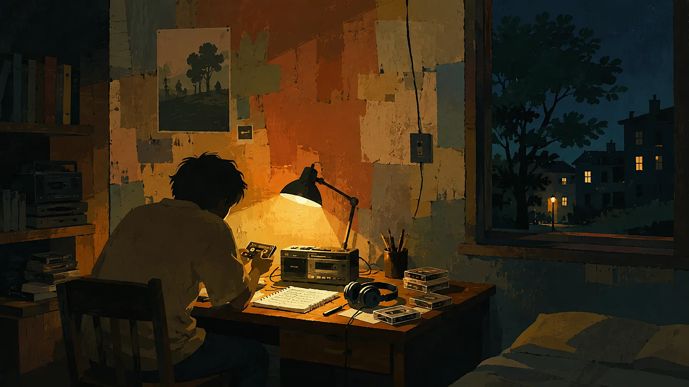
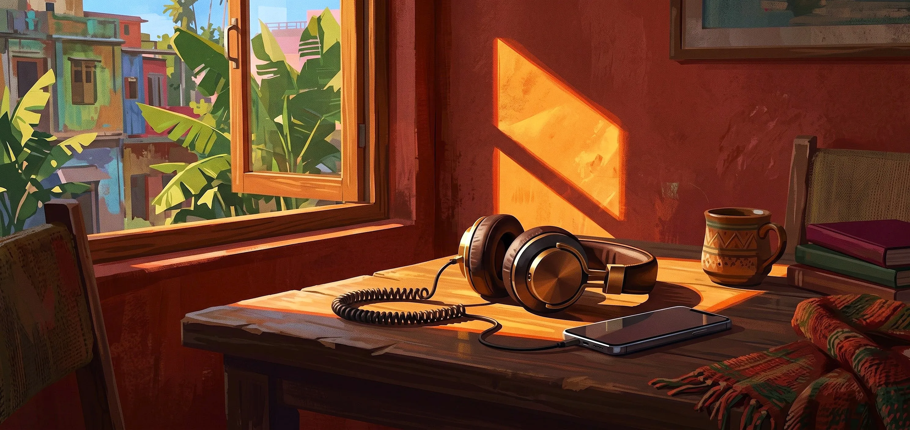

# 🎨 Essential Visual Assets — Viral Radio Site

A curated gallery of production-ready, hand-painted 2D background artworks and aesthetic scene variations created for the **Viral Radio Site (Playlist)**. 

These assets follow the locked 2D animation background art style (opaque gouache/tempera color planes, strong shape hierarchy, controlled lighting, and deliberate negative space) and are optimized for direct use as hero backgrounds, playlist themes, and audio player backdrops.

---

## 📋 Asset Directory & Overview

| Asset File | Theme / Vibe | Resolution | Aspect Ratio | Ideal Playlist Mood |
|---|---|:---:|:---:|---|
| [`console.webp`](./console.webp) | 90s Retro Gaming & Nostalgic Room | 1672 × 941 | 16:9 | Synthwave, 90s OSTs, Chiptune, Nostalgia Pop |
| [`House.webp`](./House.webp) | Urban Street Stall DJ & Vinyl Hub | 2976 × 1408 | 21:9 Ultrawide | Hip-Hop Beats, Street Funk, Global Grooves |
| [`muscic box.webp`](./muscic%20box.webp) | Vintage Cassette Player at Twilight | 1672 × 941 | 16:9 | Midnight Jazz, Ambient, Late Night Lo-Fi |
| [`music player.webp`](./music%20player.webp) | Daytime Studio Flatbed Tape Deck | 2730 × 1536 | 16:9 | Indie Folk, 90s Alternative, Acoustic Morning |
| [`music player2.webp`](./music%20player2.webp) | Study Desk Tape Player & Books | 2730 × 1536 | 16:9 | Lo-Fi Beats to Study To, Classical Chill |
| [`spider.webp`](./spider.webp) | Cyberpunk Neon Skyline Leap of Faith | 4200 × 1760 | 21:9 Ultrawide | Phonk, Cyberpunk Synth, High-Energy Electronic |
| [`study.webp`](./study.webp) | Cozy Late-Night Study Lamp & Cassettes | 1672 × 941 | 16:9 | Study Lo-Fi, Deep Focus, Rain & Coffee |
| [`table.webp`](./table.webp) | Sunlit Balcony Morning Table | 2976 × 1408 | 21:9 Ultrawide | Coffee Shop Acoustic, Bossa Nova, Morning Chill |

---

## 🖼️ Visual Gallery & Asset Previews

---

### 1. 🎮 Retro Gaming Room & Console Setup (`console.webp`)



- **File Name:** `console.webp`
- **Resolution:** `1672 × 941` (16:9 Landscape)
- **Visual Description:** A nostalgic 1990s bedroom scene featuring a classic Sony PlayStation 1 with wired controllers, boombox cassette player, retro portable Walkman with headphones, and game cases (*Tekken 3*, *Resident Evil 2*, *Need for Speed III*, *Road Rash*, *FIFA 98*) bathed in warm afternoon sunlight through an open window.
- **Recommended Use:** 90s gaming playlists, retro synthwave streams, chiptune stations.

---

### 2. 🏪 Urban Street Stall DJ & Vinyl Hub (`House.webp`)



- **File Name:** `House.webp`
- **Resolution:** `2976 × 1408` (21:9 Ultrawide Landscape)
- **Visual Description:** A vibrant street-level music stall with a bold red architectural facade, open-air turntable and laptop setup, vinyl crates, banana trees, and local figures relaxing and enjoying the groove in an Indian neighborhood setting.
- **Recommended Use:** Hip-Hop instrumental hubs, funk/groove radios, worldly beats, culture-forward playlists.

---

### 3. 📻 Vintage Cassette Player at Twilight (`muscic box.webp`)


- **File Name:** `muscic box.webp`
- **Resolution:** `1672 × 941` (16:9 Landscape)
- **Visual Description:** A retro mechanical tape recorder sitting on a wooden desk right next to an open window overlooking evening trees and distant city streetlights at dusk, accompanied by studio headphones and handwritten notebook pages.
- **Recommended Use:** Late-night radio stations, ambient chillout lounges, midnight jazz playlists.

---

### 4. 🎙️ Daytime Studio Flatbed Tape Deck (`music player.webp`)


- **File Name:** `music player.webp`
- **Resolution:** `2730 × 1536` (16:9 Landscape)
- **Visual Description:** A sunlit tabletop scene centering on a vintage cream-and-blue flatbed cassette recorder loaded with a cassette labeled "LANA - 90's", scattered studio notes, pencils, and floppy disks under bright daylight foliage.
- **Recommended Use:** Indie rock stations, 90s nostalgia pop, songwriter acoustic playlists.

---

### 5. 📚 Cozy Study Desk Tape Player & Books (`music player2.webp`)


- **File Name:** `music player2.webp`
- **Resolution:** `2730 × 1536` (16:9 Landscape)
- **Visual Description:** A bright daytime study nook featuring a well-loved cassette player, coiled headphone cable, notebook with pencil shavings, stacked hardcover books, and a window framing soft blue skies and fluffy clouds.
- **Recommended Use:** Lo-Fi study beats, reading & focus streams, daytime chill radios.

---

### 6. 🏙️ Cyberpunk Neon Skyline Leap of Faith (`spider.webp`)



- **File Name:** `spider.webp`
- **Resolution:** `4200 × 1760` (21:9 Ultrawide Landscape)
- **Visual Description:** An epic, cinematic aerial shot of a hooded hero executing a headfirst dive over a sprawling cyberpunk city skyline filled with glowing neon signs, skyscrapers, and chromatic glitch textures against a dark purple dusk sky.
- **Recommended Use:** Phonk channels, electronic/hyperpop stations, high-energy gaming or workout playlists.

---

### 7. 🕯️ Cozy Late-Night Study Lamp & Cassettes (`study.webp`)



- **File Name:** `study.webp`
- **Resolution:** `1672 × 941` (16:9 Landscape)
- **Visual Description:** A serene lo-fi night scene of a student seated at a wooden desk illuminated by the warm golden glow of an anglepoise lamp, holding and inspecting a cassette tape alongside a radio player, headphone set, and dark window looking onto peaceful neighborhood homes.
- **Recommended Use:** Sleep & study radio streams, deep focus lo-fi, midnight coding playlists.

---

### 8. ☕ Sunlit Balcony Morning Table (`table.webp`)



- **File Name:** `table.webp`
- **Resolution:** `2976 × 1408` (21:9 Ultrawide Landscape)
- **Visual Description:** A tranquil morning aesthetic featuring a wooden desk bathed in dramatic diagonal morning sunlight, studio headphones plugged into a smartphone, a warm ceramic mug, stacked books, and an open window looking out to lush tropical palm leaves and colorful street homes.
- **Recommended Use:** Morning coffee acoustic radio, Bossa Nova lounge, chill instrumental stations.

---

## 💡 How to Use in Your Vibe-Coded Web App

1. **Copy into `public/` directory:**
   ```bash
   cp "viral radio site (playlist)/assets/console.webp" "my-app/public/background.webp"
   ```

2. **Set as dynamic CSS / Tailwind background:**
   ```tsx
   <div 
     className="fixed inset-0 bg-cover bg-center -z-10" 
     style={{ backgroundImage: `url('/background.webp')` }}
   >
     {/* Dark overlay gradient at bottom to keep floating player controls legible */}
     <div className="absolute inset-0 bg-gradient-to-t from-black/80 via-black/20 to-transparent" />
   </div>
   ```

3. **Multi-theme Playlist Switcher:**
   You can easily cycle through these backgrounds as users switch radio channels or genres (e.g. `Lo-Fi` -> `study.webp`, `90s Retro` -> `console.webp`, `Phonk` -> `spider.webp`).

---

[⬅️ Back to Viral Radio Site Prompt & Documentation](../README.md)
